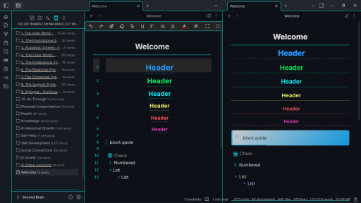
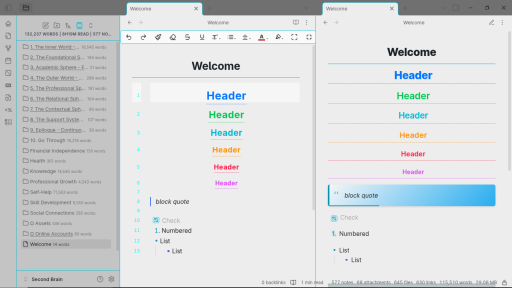

# Dedication 2 Theme for Obsidian

A sophisticated, highly customizable dark theme for Obsidian with premium color presets inspired by iconic sci-fi, fantasy, and cinematic aesthetics.

## Dark Mode 

## Light Mode

## Features

### Premium Color Presets
- **Original Dark** - The elegant default theme with beautiful blue, cyan, and gold accents
- **Matrix Green** - Classic terminal green on black for coding enthusiasts
- **Blade Runner** - Cinematic cyberpunk palette with neon accents
- **Dark Knight** - Sophisticated dark theme with gold and deep red accents
- **Gotham Noir** - Monochromatic elegance with strategic gold highlights
- **Cosmic Blue** - Deep space-inspired blues with cosmic accents
- **Star Trek** - Professional sci-fi theme with command gold and science blue

### Typography Options
- **Inter** (Default) - Clean modern sans-serif
- **System Fonts** - Your OS default fonts
- **Georgia Serif** - Classic serif for traditional reading
- **Helvetica Neue** - Professional sans-serif
- **Source Sans Pro** - Friendly readable sans-serif
- **Roboto Mono** - Clean monospace for coding

### Enhanced UI Elements
- Beautiful heading indicators with colored bars
- Animated pendulum startup loading
- Custom calendar styling with colored weekdays
- Sophisticated table designs
- Custom tooltip styling

## Installation

1. Open Obsidian Settings
2. Go to **Appearance** → **Themes**
3. Click **Manage** and search for "Dedication 2"
4. Select and activate the theme

## Customization

### Style Settings Plugin (Recommended)
Install the **Style Settings** plugin to access all customization options:

1. Go to **Community Plugins** → **Browse**
2. Search for "Style Settings" and install
3. Restart Obsidian and enable the plugin
4. Access settings via Settings → Style Settings

### Available Customizations

#### Color Schemes
- Switch between 7 premium color presets
- Each preset includes both dark and light variants
- Presets maintain consistent visual hierarchy

#### Typography
- 6 font family options
- Maintains readability across all choices
- Proper font stacking for cross-platform compatibility

## Recommended Settings

### For Best Experience
- Enable **Style Settings** plugin for full customization

## Contributing

We welcome contributions! Feel free to:
- Submit bug reports
- Suggest new color presets
- Improve documentation
- Share your customizations

## License

This theme is released under the MIT License.

---
